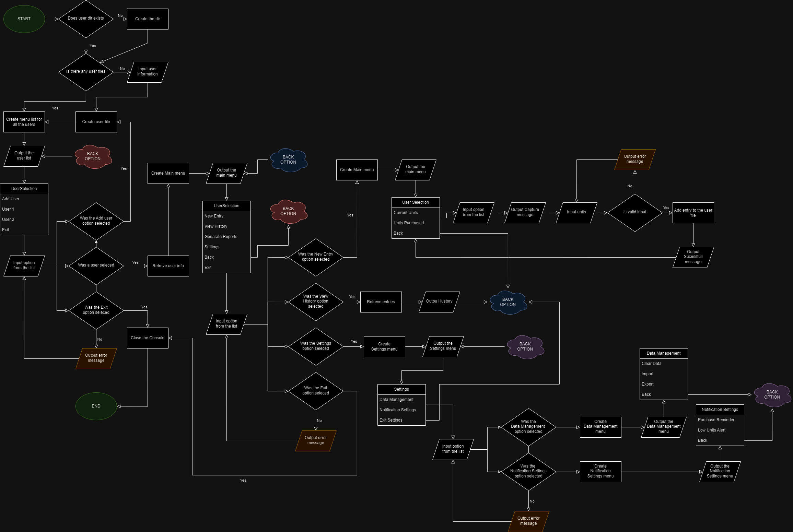
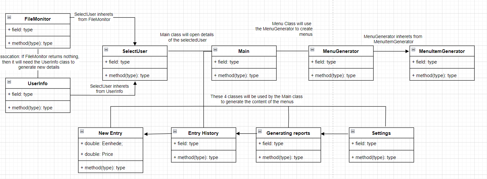

# PRG 281 Project

## Title Page

**Project Title:** Electricity Usage Tracking System for Prepaid Meters**Team Members:**

- **Dean Jacobus Andreas van Zyl (600367)**
- **Hermanus Jacobus Bantjes (601427)**
- **Jan-Paul Seaman (578081)**
- **Stiaan Megit (600819)**

**Course Name:** Programming 281
**Date of Submission:** 27 August 2024

---

## Table of Contents

1. [Introduction](#introduction)
   - [Overview](#overview)
   - [Problem Statement](#problem-statement)
   - [Project Objectives](#project-objectives)
   - [Development Approach](#development-approach)
2. [Topic Identification](#topic-identification)
   - [Classes and Objects](#classes-and-objects)
   - [Custom Threads](#custom-threads)
   - [Custom Events and Delegates](#custom-events-and-delegates)
   - [Interfaces (Custom and Built-in)](#interfaces-custom-and-built-in)
   - [Polymorphism](#polymorphism)
   - [Custom and Built-in Exceptions](#custom-and-built-in-exceptions)
   - [Security Measures](#security-measures)
3. [Flowchart](#flowchart)
4. [Class Diagram](#class-diagram)
5. [Detailed Project Plan](#detailed-project-plan)
   - [Project Goals](#project-goals)
   - [Task Allocation](#task-allocation)
6. [Requirements Analysis](#requirements-analysis)
   - [Functional Requirements](#functional-requirements)
   - [Non-Functional Requirements](#non-functional-requirements)
7. [Risk Analysis](#risk-analysis)
   - [Potential Risks](#potential-risks)
   - [Mitigation Strategies](#mitigation-strategies)
8. [Conclusion](#conclusion)
9. [Appendices](#appendices)

---

## 1. Introduction

### Overview

The objective of this project is to create a software application that enables users to monitor their usage of prepaid electricity. The program will allow users to enter meter readings manually and gain better control over their electricity consumption.

### Problem Statement

Prepaid electricity users often struggle to keep track of remaining units and knowing when to purchase more power. Our solution aims to address this challenge by providing a user-friendly interface for inputting meter data and effectively monitoring electricity usage trends over time.

### Project Objectives

- Track electricity usage by recording meter readings.
- Generate usage reports and alert users when their units are low.
- Provide a user-friendly system for managing prepaid electricity information.

### Development Approach

We are utilizing an iterative methodology involving continuous feedback and testing at each development stage. After completing each goal, we will incorporate the features and have them evaluated by other team members. This allows us to make necessary adjustments and refinements. Feedback will be documented, logged, and assigned to team members for further review and action.

---

## 2. Topic Identification

### Classes and Objects

Classes act as templates for creating and managing objects, holding properties like a user’s ID, name, and electricity meter information. Objects are instances of these classes and contain specific data.

- **Why:** Using classes and objects allows easy definition, storage, and retrieval of specific information instances.
- **How:** We will create classes like `User`, `ElectricityMeter`, and `UsageRecord` and insert objects into them, holding user information, power usage data, and related calculations.

### Custom Threads

Threads will handle background tasks such as monitoring meter readings for low units and generating alerts.

### Custom Events and Delegates

Custom events will trigger alerts when predefined conditions, such as low units, are met.

### Interfaces (Custom and Built-in)

- **IReportable:** Custom interface for generating various types of usage reports.
- **IDisposable:** Built-in interface to manage file handling.

### Polymorphism

Different user types (e.g., regular user vs. admin) will inherit from a common base class.

### Custom and Built-in Exceptions

Implement exceptions for invalid data entries and handle errors related to file operations.

### Security Measures

- Input validation to ensure data integrity.
- Data encryption for sensitive information (if applicable).

---

## 3. Flowchart

---

## 4. Class Diagram

---

## 5. Detailed Project Plan

### Project Goals

1. **Rough Documentation:** Create the preliminary version of documentation.
2. **Core Functionality:** Implement core functionality.
3. **Program Navigation:** Implement overall program navigation.
4. **User File Management:** Implement file creation, data storage, and reading methods.
5. **Power Usage Calculations:** Implement average usage calculation methods.
6. **Report Generation:** Implement report generation methods.
7. **Generate Test Data:** Create entries for testing.
8. **Testing:** Test the program thoroughly.
9. **Final Documentation:** Finalize documentation.

### Task Allocation

- **Dean:** 
   - Design and implement core classes like `User`, `Entry`, `Navigation`
   - Implement methods for data management like `ReadUserData`, `ImportUserData`, `ExportUserData`, `ClearData`.
   - Implement methods for file management like `FileExists`, `CreateUserFile`.
   - Design and implement console app navigation class with the ability to `create menus`, `add menu items`, `exicute code when menu item is selected`, `console disply and clear`.
- **Hermanus:**
   - Implement data reading functionality.
- **Jan-Paul:** 
   - Design and implement the `Calculation` class.
- **Stiaan:**
   - Implement reporting functionality, file I/O, and threading with custom alerts.

---

## 6. Requirements Analysis

### Functional Requirements

- **Core Features:**
  - Create users.
  - Log and track electricity usage.
  - Send alerts when units are low.
  - Generate usage reports.
- **Usability:** User-friendly interface for entering meter readings.

### Non-Functional Requirements

- **Performance:** Real-time processing of user input and alerts.
- **Security:** Input validation to prevent invalid data and protect user information.
- **Scalability:** The program should handle multiple users and different electricity meters.

---

## 7. Risk Analysis

### Potential Risks

1. **Time Management:** Balancing project deadlines with other coursework.
2. **Technical Challenges:** Implementing threading, event handling, and file I/O.
3. **Data Integrity:** Ensuring data is saved correctly and remains consistent.

### Mitigation Strategies

- Regular team meetings to track progress.
- Early testing to identify and fix issues before final development.
- Regular backups of user data to prevent loss.

---

## 8. Conclusion

This documentation outlines the key components of our electricity usage tracking system. The next phase involves the implementation stage, where the planned features will be developed and integrated into a cohesive application. Testing and iteration will refine the system to ensure it meets user needs.

---

## 9. Appendices

[**Draw io**](https://app.diagrams.net): Used to create flow chart and class diagram.
[**W3 Schools**](https://www.w3schools.com): Used to find spesific syntax for code.
